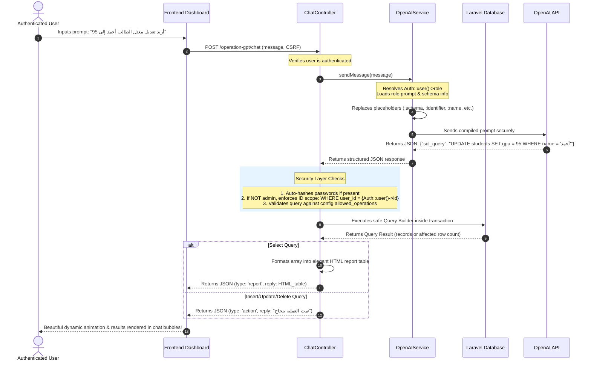

# OperationGpt 🤖📊

A powerful Laravel package that allows users to interact with their system database using natural language via a beautiful chat interface.

## 🌟 Key Features

* **AI-Driven DB Operations**: Insert, update, and select database records using everyday natural language (e.g., Arabic prompts).
* **Security-First Architecture**: Built on a strict **"deny-by-default" whitelisting** protocol. The AI never writes raw queries directly; it generates structured instructions that are thoroughly validated.
* **Role-Based Prompts & Permissions**: Dynamic system prompts and operation limitations based on the authenticated user's role (`super_admin`, `teacher`, `student`, `user`, etc.).
* **Automatic PII & Password Hashing**: Any text containing passwords in `INSERT` or `UPDATE` statements is automatically hashed securely before database execution.
* **Modern HTML Report Generator**: Automatically converts database query results into beautiful, readable, and responsive HTML tables with HSL/glassmorphism aesthetics.
* **Transaction Safe**: All write operations run inside database transactions. A failure at any step causes an automatic, safe rollback.

---

## 🚀 Step 1: Installation & Setup

### 1. Install via Composer
Run the following command in your Laravel application root:
```bash
composer require operation-gpt/operation-gpt
```

### 2. Publish Configuration Files
Publish both the general configuration and the role prompt configurations:
```bash
php artisan vendor:publish --provider="OperationGpt\OperationGptServiceProvider"
```
This command will create two essential configuration files in your application's `config/` directory:
1. **`config/operation-gpt.php`** — General settings & allowed tables database schema.
2. **`config/operation-gpt-prompts.php`** — Roles, descriptions, constraints, and AI prompts.

### 3. Add OpenAI Credentials
Add your OpenAI API credentials and preferred model to your main project's `.env` file:
```env
OPENAI_API_KEY=sk-proj-your-api-key-here
OPERATION_GPT_MODEL=gpt-4o
```

---

## 🛡️ Step 2: Defining Allowed Tables (The Security Layer)

> [!IMPORTANT]
> **Security Protocol:** By default, the package will block any and all access to your database. You **MUST** explicitly whitelist the tables and columns the AI is allowed to interact with.

### 📍 Where to configure?
Open **`config/operation-gpt.php`**

### 💻 Configuration Example:
```php
return [
    'openai_api_key' => env('OPENAI_API_KEY', ''),
    'model' => env('OPERATION_GPT_MODEL', 'gpt-4o'),

    /*
    |--------------------------------------------------------------------------
    | Whitelisted Tables & Columns
    |--------------------------------------------------------------------------
    | The AI can ONLY view or modify the tables and columns defined here.
    | Any mention of other tables (e.g., 'migrations', 'settings') will be blocked.
    */
    'allowed_tables' => [
        'users'       => ['id', 'name', 'email', 'password', 'role', 'created_at', 'updated_at'],
        'teachers'    => ['id', 'user_id', 'department', 'specialization', 'salary'],
        'students'    => ['id', 'user_id', 'gpa', 'grade_level', 'classroom'],
        'employees'   => ['id', 'name', 'position', 'salary', 'department_id'],
        'departments' => ['id', 'name'],
    ],

    'logging' => true, // Set to true to log final SQL statements to storage/logs/laravel.log
];
```

---

## 👥 Step 3: Role-Based System & Prompts Configuration

Each authenticated user has a specific **Role**. The system automatically fetches this role to decide what prompts the AI receives, what operations are permitted, and how query scopes are restricted.

### 📍 Where does the Role come from?
The system reads the `role` attribute directly from the currently authenticated Laravel user:
```php
$userRole = Auth::user()->role; // Defaults to 'user' if not defined or null
```
Make sure your `users` table has a `role` column (or dynamic accessor) that returns values like `'super_admin'`, `'teacher'`, `'student'`, or `'user'`.

### 📍 Where to configure the Roles, Constraints, and Prompts?
Open **`config/operation-gpt-prompts.php`**

Inside this file, you can define and customize:
1. **`constraints` (Allowed Operations)**: What SQL operations this role is authorized to perform (e.g. `SELECT`, `INSERT`, `UPDATE`, `DELETE`).
2. **`prompt` (System Prompt)**: The custom guidelines and capabilities the AI must follow when assisting this specific role.

### 💻 Configuration Structure (`config/operation-gpt-prompts.php`):
```php
return [
    'roles' => [

        // 1. Super Administrator
        'super_admin' => [
            'name' => 'School Administrator',
            'description' => 'مدير النظام - صلاحيات كاملة لقراءة وتعديل جميع الجداول المسموحة.',
            'constraints' => [
                'allowed_operations' => ['SELECT', 'INSERT', 'UPDATE', 'DELETE'],
            ],
            'prompt' => "You are the School Database Admin. Role: Super Admin. You have full access to view, edit, and delete from users, teachers, and students tables. Generate clean, safe SQL queries based on allowed schema.",
        ],

        // 2. Teacher
        'teacher' => [
            'name' => 'Teacher',
            'description' => 'المعلم - يمكنه قراءة الجداول وتعديل بيانات الطلاب فقط.',
            'constraints' => [
                'allowed_operations' => ['SELECT', 'UPDATE'],
            ],
            'prompt' => "You are a Teacher Assistant. Role: Teacher. You can SELECT from all tables. You can ONLY UPDATE the `students` table (like modifying gpa or grade). You are NOT allowed to modify `teachers` or `users` tables.",
        ],

        // 3. Student (Self-Viewing Only)
        'student' => [
            'name' => 'Student',
            'description' => 'الطالب - صلاحية قراءة فقط ومقيد برؤية بياناته الشخصية.',
            'constraints' => [
                'allowed_operations' => ['SELECT'],
            ],
            'prompt' => "You are a Student Assistant. Role: Student. You can ONLY SELECT data. STRICT RULE: You MUST append `user_id = :identifier` or `id = :identifier` to the WHERE clause when querying tables to ensure the student only sees their own data.",
        ],

        // 4. Standard Fallback User
        'user' => [
            'name' => 'Standard User',
            'description' => 'مستخدم عادي - صلاحية قراءة فقط للجداول المتاحة.',
            'constraints' => [
                'allowed_operations' => ['SELECT'],
            ],
            'prompt' => "You are a standard Database Assistant. Role: User. Capability: You can ONLY SELECT data from the allowed tables. You cannot modify any data.",
        ],
    ],

    /*
    |--------------------------------------------------------------------------
    | Global Prompt Rules
    |--------------------------------------------------------------------------
    | Appended automatically to every role-based prompt to enforce security and JSON formatting.
    */
    'global_rules' => [
        "OUTPUT: JSON ONLY. Key: 'sql_query'.",
        "SCHEMA: :schema",
        "USER CONTEXT: Name: ':name', ID: ':identifier'.",
        "SECURITY: Use :password_hash for new passwords.",
        "DATE: Use ':current_date' for timestamps.",
        "FORMAT: NO MARKDOWN. NO ```json blocks. Just the raw JSON string.",
    ],
];
```

---

## 🗺️ Developer File Directory: Where to Write/Modify Code?

If you are a developer looking to customize the package behaviour, here is your structural guide on **"where to write what"**:

```
operation-gpt/
├── src/
│   ├── Config/
│   │   ├── config.php                  <-- [WRITE HERE] To set default allowed tables & database whitelist.
│   │   └── prompts.php                 <-- [WRITE HERE] To customize system prompts, role constraints, and rules.
│   │
│   ├── Http/
│   │   └── Controllers/
│   │       └── ChatController.php      <-- [WRITE HERE] To adjust security parsing, query execution, role checks, password hashing, and HTML reports.
│   │
│   ├── Services/
│   │   └── OpenAIService.php           <-- [WRITE HERE] To edit the OpenAI payload, dynamic variable replacements (:schema, :identifier, :current_date) and API logic.
│   │
│   ├── Routes/
│   │   └── api.php                     <-- [WRITE HERE] Web and api route definitions.
│   │
│   └── OperationGptServiceProvider.php <-- Bootstraps & registers config, views, assets, and routes.
│
├── resources/
│   └── views/
│       └── chat.blade.php              <-- [WRITE HERE] The blade template displaying the professional chat dashboard.
│
└── public/
    └── frontend/
        ├── chat-style.css              <-- [WRITE HERE] Styling, dark mode theme, glassmorphism, animations.
        └── chat-app.js                 <-- [WRITE HERE] Frontend JS, SSE/AJAX event listeners, chat bubbling.
```

---

## 💡 How it Works Under the Hood (Step-by-Step Flow)



---

## 🛡️ Security Guarantees & Safeguards

1. **Password Protection**: Any query that sets or updates a password dynamically captures the plain-text password and hashes it using Laravel's secure `Hash::make()` algorithm before hitting the database.
2. **Scope Isolation**: Regular users or students who attempt to run an `UPDATE` command are strictly and automatically bound to their own record. The controller automatically forces the query to end with `WHERE user_id = Auth::id()` to prevent horizontal privilege escalation.
3. **Restricted Operations**: Even if the AI generates a query containing `DELETE` or `DROP`, if the user's role config inside `operation-gpt-prompts.php` does not explicitly allow it, the execution will be immediately blocked, returning a friendly localized error to the client.

---

## 📝 License
MIT License. Created with ❤️ for premium, secure database interactions.
